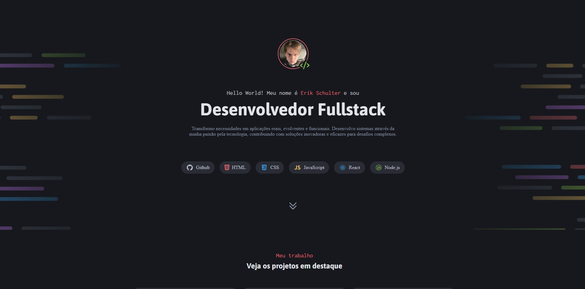

<h1 align="center"> DevFolio </h1>

Página para um Portfólio Dev  

  <a href="#-tecnologias">Tecnologias</a>&nbsp;&nbsp;&nbsp;|&nbsp;&nbsp;&nbsp;
  <a href="#memo-licença">Licença</a>

  

 

  

## 🚀 Tecnologias

Esse projeto foi desenvolvido com as seguintes tecnologias:

- HTML e CSS
- Git e Github
- Figma

## 💻 Projeto

O DevFolio é uma página de portfólio.

- [Acesse o projeto finalizado, online](https://erikschulter.github.io/DevFolio)

## :memo: Licença

Esse projeto está sob a licença MIT.
